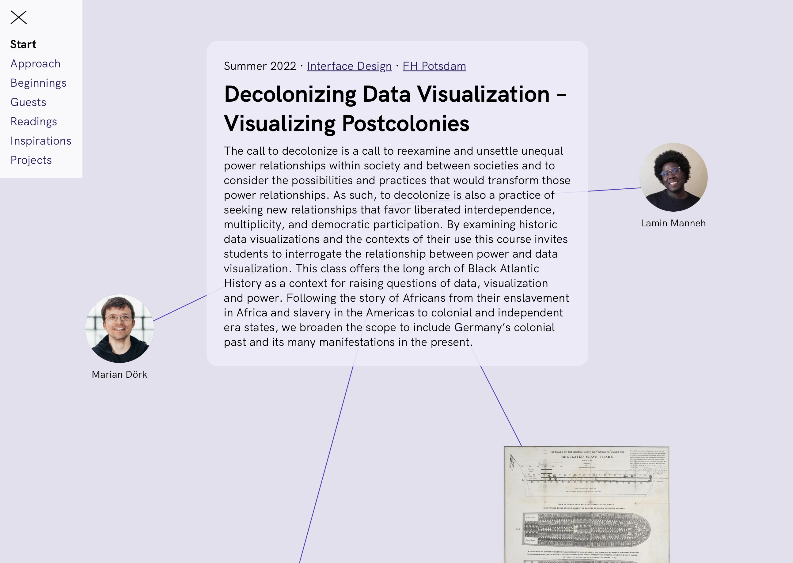
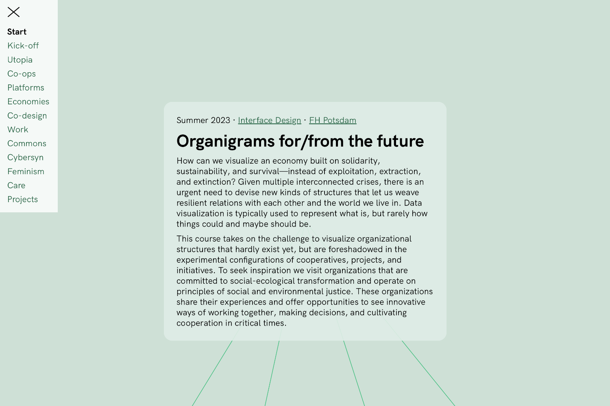

# Syllabus Site

An experiment in documenting design courses
and a template for displaying markdown files as scrollable web pages.

The parallax effect separates items as foreground from sections as background.

Design is all about process, but the way we document design courses focuses on product. *Syllabus Site* is an attempt to shift the focus from product to process.

This page tries to answer [Why](#why), [What](#what) & [How](#how). 

---

## Why

In the realm of design education, there's a common emphasis on the final outcomes—be it presentations or prototypes. This focus, while essential, tends to sideline the  exploratory and dynamic process leading to these results. The journey to the final projects is marked by twists, turns, and tangents. This is where much of the learning and discovery occurs. 

*Syllabus Site* was conceived as a tool to highlight and document these critical but frequently overlooked aspects of design courses. It serves as a dynamic platform, chronicling the semester-long voyage of seminar participants through an array of readings, activities, and discussions that can be linked with each week's session. This approach not only retains but celebrates the evolving nature of a design course's intellectual and aesthetic journey, ensuring that the wealth of shared inspirations—from historical examples and theoretical frameworks to contemporary projects and research studies—is preserved and made more accessible. 

We created *Syllabus Site* as a distinct format for collective diaries of design courses forming a kind of communal space where the various sources that foster creativity, dialogue, and learning are gathered and shared. So, please, feel free to use this template to document your own journeys in design education!

---

## What

A *Syllabus Site* is a simple one-page website that can be scrolled vertically. 
There are two types of elements:

- **Sections**: Larger blocks that gather the material for each weekly course session.
- **Items**: Smaller elements such as images, paragraphs, lists, and other kinds of content.

Each item is connected with its section by a thin line. The navigation (≡) gives access to all sections.

The template has been used to document two experimental courses offered in the [Interface Design](https://interface.fh-potsdam.de) program at [FH Potsdam](https://www.fh-potsdam.de/).

[Decolonizing Data Visualization – Visualizing Postcolonies](https://infovis.fh-potsdam.de/decolonizing/)  
Lamin Manneh & Marian Dörk  
Summer 2022

[Organigrams for/from the future](https://infovis.fh-potsdam.de/organigrams/)  
Marian Dörk & Myriel Milicevic  
Summer 2023

---

## How

*Syllabus Site* is a simple template for web pages with minimal technical requirements.

**Syntax**

The page source is written in [Markdown](https://en.wikipedia.org/wiki/Markdown), a simple markup language used by many platforms including GitHub.

There are two conventions we use to distinguish sections and items:

- Sections are delineated by a horizontal rule `---` 
- Items are separated by two empty consecutive lines

Each section should contain a heading:
`#` for primary, `##` for secondary, and so on.

**File structure**

The template contains two folders:

`img/` → for images to be included on the webpage  
`src/` → necessary source files for the template  

… and two files:

`index.html` → connects template and your content  
`README.md` → your content formatted in Markdown  

**Set up your own**

1. Download or clone this [GitHub repository](https://github.com/uclab-potsdam/syllabus-site/)
2. Add your content into `README.md` and `img/`
3. Include title and open graph fields in `index.html` and adjust theme color

**Things to consider**

- Make sure to include an expressive preview image `img/cover.png` ideally in the dimensions 1200x630
- …

---

 
 

[Contact](mailto:marian.doerk@fh-potsdam.de,philipp.proff@gmx.de?subject=Syllabus%20Site) · [Imprint](https://www.fh-potsdam.de/impressum) · [Source](https://github.com/uclab-potsdam/syllabus-site/)