Summer 2023 · [Interface Design](https://interface.fh-potsdam.de) · [FH Potsdam](https://www.fh-potsdam.de/)

# Organigrams for/from the future

How can we visualize an economy built on solidarity, sustainability, and survival—instead of exploitation, extraction, and extinction? Given multiple interconnected crises, there is an urgent need to devise new kinds of structures that let us weave resilient relations with each other and the world we live in. Data visualization is typically used to represent what is, but rarely how things could and maybe should be.

This course takes on the challenge to visualize organizational structures that hardly exist yet, but are foreshadowed in the experimental configurations of cooperatives, projects, and initiatives. To seek inspiration we visit organizations that are committed to social-ecological transformation and operate on principles of social and environmental justice. These organizations share their experiences and offer opportunities to see innovative ways of working together, making decisions, and cultivating cooperation in critical times.

Marian Dörk

Myriel Milicevic

[New York and Erie Railroad diagram](https://www.loc.gov/item/2017586274/), 1855
considered to be the first organigram

This webpage is an experiment in documenting design courses. Below you find the readings and references along central [themes](#themes), our generous [hosts](#hosts), and the resulting student [projects](#projects).

---

3.4.
## Kick-off

This is a nomadic course about the visualization of organizational structures utilizing narration and exploration to encourage reflection and imagination about work and the economy.

> It's easier to imagine the end of the world than the end of capitalism.

Fredric Jameson, 1996

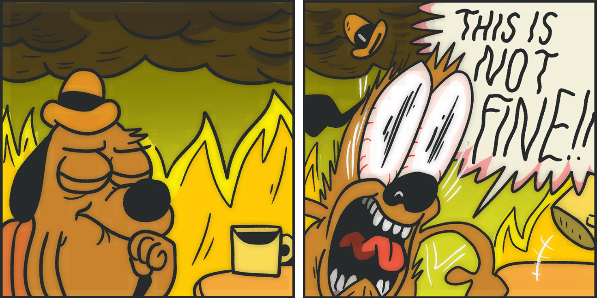
[This is Not Fine](https://thenib.com/this-is-not-fine/)  
K.C. Green, 2016

> It is hard to say what today's dreams are; it seems they have been downgraded to hopes—hope that we will not allow ourselves to become extinct, hope that we can feed the starving, hope that there will be room for us all on this tiny planet. There are no more visions. We don't know how to fix the planet and ensure our survival. We are just hopeful.

[Speculative everything: design, fiction, and social dreaming](https://readings.design/PDF/speculative-everything.pdf) by Anthony Dunne & Fiona Raby, 2013

[Flying Gardens of Maybe](https://www.andrewyang.net/maybe)  
Andrew Yang, 2012

> That is the fundamental nature of gifts: they move, and their value increases with their passage. The fields made a gift of berries to us and we made a gift of them to our father. The more something is shared, the greater its value becomes. This is hard to grasp for societies steeped in notions of private property, where others are, by definition, excluded from sharing. Practices such as posting land against trespass, for example, are expected and accepted in a property economy but are unacceptable in an economy where land is seen as a gift to all.

> From the viewpoint of a private property economy, the “gift” is deemed to be “free” because we obtain it free of charge, at no cost. But in the gift economy, gifts are not free. The essence of the gift is that it creates a set of relationships. The currency of a gift economy is, at its root, reciprocity. In Western thinking, private land is understood to be a “bundle of rights,” whereas in a gift economy property has a “bundle of responsibilities” attached.

[Braiding Sweetgrass: Indigenous Wisdom, Scientific Knowledge and the Teachings of Plants](https://en.wikipedia.org/wiki/Braiding_Sweetgrass) by Robin Wall Kimmerer, 2013

### Guiding research questions

- How can we translate observations about innovative organizational structures and work processes into coherent data visualizations?
- What are approaches that let us integrate social, aesthetic, and technical aspects into intriguing and informative representations?
- Is it possible to account for complex issues in a comprehensible data visualization that does justice to the social and ecological challenges?

<h3 id="themes">Themes</h3>

Each course session covers one central theme that is accompanied by a key reading and a range of visual materials such as exemplary diagrams and visualizations:

- [Utopia](#utopia)
- [Co-ops](#co-ops)
- [Platforms](#platforms)
- [Economies](#economies)
- [Co-design](#co-design)
- [Work](#work)
- [Commons](#commons)
- [Cybersyn](#cybersyn)
- [Feminism](#feminism)
- [Care](#care)

<h3 id="hosts">Hosts</h3>

Every week the course takes place at different locations in Berlin or Potsdam. Below are the organizations and initiatives that have agreed to tell us all about their organizational structures and generously offered to host us for one seminar session each:

-   [WIGWAM eG - Kommunikationsagentur](https://wigwam.im)
-   [INFOTEXT - Agentur für Content & Grafikdesign](https://infotext-berlin.de/)
-   [SMartDe eG - Genossenschaft für Selbständige](https://smart-eg.de)
-   [Regionalwert AG Berlin Brandenburg](https://regionalwert-berlin.de)
-   [Backstube Vollkornbäckerei](http://die-backstube.de)
-   [gruppe F Berlin - Freiraum für alle GmbH](https://gruppef.com/)
-   [Regenbogenfabrik e.V. - Kinder-, Kultur- und Nachbarschaftszentrum](http://regenbogenfabrik.de)
-   [SuperCoop Berlin - This is not a SuperMarket…](https://supercoop.de)
-   [WeiberWirtschaft eG - Standort für Chefinnen](https://weiberwirtschaft.de/)
-   [Madia Potsdam - Gemeinschaft, Café und Familienwohnzimmer](https://madia-potsdam.de)

---
17.4. Wigwam
## Utopia

[Wigwam eG - Kommunikationsagentur](https://wigwam.im/)

Organigram of Wigwam, 2023

[Diagram Utopias: Rota and Network as Instrument and Mirror of Utopia and Agronica](https://www.researchgate.net/profile/Christoph-Lueder/publication/271929881_Diagram_Utopias_Rota_and_Network_as_Instrument_and_Mirror_of_Utopia_and_Agronica/links/5cce194b458515712e9285a2/Diagram-Utopias-Rota-and-Network-as-Instrument-and-Mirror-of-Utopia-and-Agronica.pdf) by Christoph Lueder. Journal of Architectural Education, 67(2):224–233, 2013.

> Utopian visions and diagrams have engaged in a multitude of relationships. For example, a utopian narrative can be conceived as a diagram, or with the aid of diagrams, and understood through diagrammatic (re) annotation. This notion is explored through an interpretation of Thom- as More’s Utopia and Andrea Branzi’s Agronica. Both schemes address various structural conditions through diagrammatic operations. In More’s scheme the channel that separates Utopia from the mainland, dug by its putative founder King Abraxas, inscribes a circular boundary, reiterated in the city walls and moat; it is resonant with contempora- neous rota and volvelle schemata. Conversely, Andrea Branzi’s “mirror simulator” multiplies Agronica’s centrifugal grid to infinity, negating the “outside,” and is evocative of pervasive virtual networks.

[The Garden of Earthly Delights](https://en.wikipedia.org/wiki/The_Garden_of_Earthly_Delights)  
Hieronymus Bosch, 1490-1510

Woodcut by Ambrosius Holbein, illustrating the 1518 edition of [Thomas More's Utopia](https://en.wikipedia.org/wiki/Utopia_(More_book))

[Astronomicum Caesareum](https://www.youtube.com/watch?v=lC2FSh-f_Xg)  
Petrus Apianus, 1540

[Garden City Concept](https://en.wikipedia.org/wiki/Garden_city_movement)  
Ebenezer Howard, 1902

[Sketches for the Broadacre City project](https://en.wikipedia.org/wiki/Broadacre_City)  
Frank Lloyd Wright, 1932

[Agronica](https://www.youtube.com/watch?v=VhfjHhhxSZc)  
Andrea Branzi, 1995

> For us today, it is still difficult to imagine a future society in which paid labor is not the be-all and end-all of our existence. But the inability to imagine a world in which things are different is evidence only of a poor imagination, not of the impossibility of change.

[Utopia for Realists](https://en.wikipedia.org/wiki/Utopia_for_Realists) by Rutger Bregman, 2017

[Why city lights and headlights still match](https://group.mercedes-benz.com/company/magazine/sustainability/sustainability-mobility-city-future.html)  
Mercedes-Benz Group, 2019

[Berlin Friedrichstraße Utopia 2048](https://realutopien.info/visuals/berlin-friedrichstrasse-utopia-2048/)  
Lino Zeddies, 2023

---
24.4. INFOTEXT
## Co-ops

[INFOTEXT - Agentur für Content & Grafikdesign](https://infotext-berlin.de/) 

[Core members of INFOTEXT](https://infotext-berlin.de/#ueber-uns/) 

[The meaning of Rochdale: The Rochdale Pioneers and the co-operative principles](https://ageconsearch.umn.edu/record/31778/files/re94fa01.pdf) by Brett Fairbairn. Technical report, University of Saskatchewan, 1994.

> Rochdale, England, is known by millions for one reason: a handful of labourers established a co-operative there in 1844 known as the Rochdale Society of Equitable Pioneers. That co-operative was adopted as the inspiration and model for a movement that now includes nearly 700 million people around the world. As this paper is being written, co-operators around the world are preparing to celebrate the 150th anniversary of its birth. But what did Rochdale mean? Why is it considered so important?"

[Co-operative flag, 1925](http://bheleccs.in/co-operative-flag/)

[Liberating Structures, 2012](https://www.liberatingstructures.com/ls-menu/)

[Mondragon Cooperative Corporation, 2015](http://www.maussen.eu/blog/2015/10/08/3-2mondragon-cooperative-corporation-mcc-3-2-5-cooperative-structure/index.htm)

[Affordable New York: Amalgamated Housing Cooperative](https://blog.mcny.org/2015/09/22/affordable-new-york-amalgamated-housing-cooperative/) by Lacy Schutz. MCNY Blog, 2015.

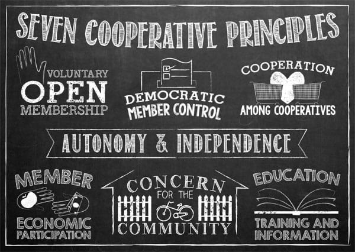
[Willy Street Co-op, 2016](https://www.willystreet.coop/about-us/about-our-coop)

[Bullfrog Films presents...FOOD COOP, 2017](https://www.youtube.com/watch?v=_Ae4CFpKCoU)

[Cover for two Upstream podcast episodes about worker cooperatives](https://www.upstreampodcast.org/workercoops1)  
Phil Wrigglesworth, 2018

[Co op City, The Bronx DiverseCITY, 2019](https://www.youtube.com/watch?v=xKYxAHMWc0c)

[Working-Class Utopias](https://press.princeton.edu/books/hardcover/9780691234748/working-class-utopias)  
Robert M. Fogelson, 2022

The following [cooperative principles](https://www.ica.coop/en/cooperatives/cooperative-identity) published by the International Cooperative Alliance (ICA) help coops turn their values into practice:

1. Voluntary and Open Membership
2. Democratic Member Control
3. Member Economic Participation
4. Autonomy and Independence
5. Education, Training, and Information
6. Cooperation among Cooperatives
7. Concern for Community

---
8.5. SMartDe
## Platforms

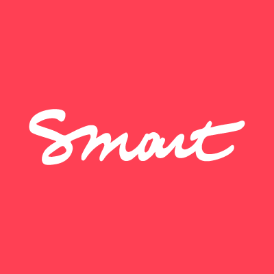

[SMartDe - the coop for freelancers](https://smart-eg.de/)

[Soziale Absicherung für Selbständige im Gemeinschaftsunternehmen SMartDe eG](https://www.youtube.com/watch?v=wPIQClkPokI)  
Alicja Möltner, 2021

[Platform cooperativism. Challenging the corporate sharing economy](https://rosalux.nyc/wp-content/uploads/2020/11/RLS-NYC_platformcoop.pdf) by Trebor Scholz, New York: Rosa Luxemburg Foundation, 2016.

> Among all the problems with 21st-century work — the ballooning of the low wage service sector, economic inequality, the crumbling of worker rights  — the main problem really is that there are so few realistic alternatives. What has been missing from the debate about the future of work is an approach that offers peo- ple something that they can wholeheartedly embrace. This is what this essay is about.

[On Distributed Communications Networks](https://pages.cs.wisc.edu/~akella/CS740/F08/740-Papers/Bar64.pdf)
Paul Baran, The RAND Corporation, 1962

[Airbnb vs. Berlin](https://airbnbvsberlin.com/)  
Alsino Skowronnek, Lucas Vogel & Jonas Parnow, FH Potsdam, 2015

[Platform Co-op Development Kit](https://platform.coop/blog/the-platform-co-op-development-kit/)  
Trebor Scholz, Platform Cooperativism Consortium, 2018

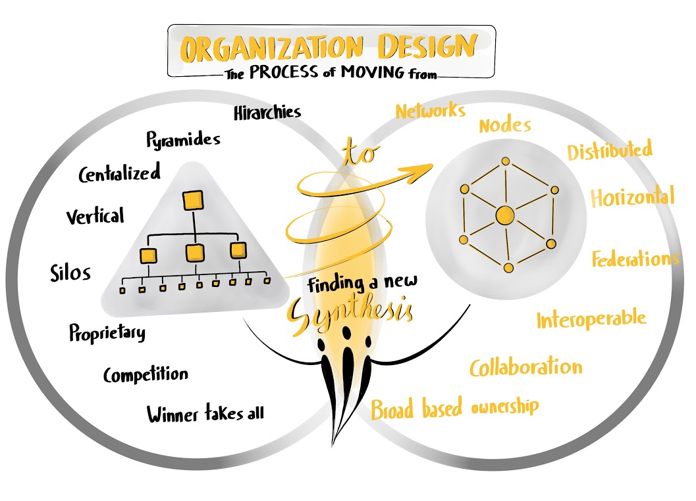
[Platform Coops Netzwerk](https://platformcoops-netzwerk.de/das-projekt/)  
Robin Hotz, 2020

[The many branches of the Fediverse](https://axbom.com/fediverse/)  
Per Axbom, 2023

[Understanding Democratic Decision-Making in Cooperatives](https://platform.coop/blog/democratic-decision-making/) by Victoria Sgarro, 2023

---
15.5. Regionalwert
## Economies

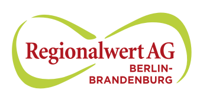

[Regionalwert AG Berlin Brandenburg](https://www.regionalwert-berlin.de/)

[Die Regionalwert-Idee (3min)](https://www.youtube.com/watch?v=TOC06ehV2K4), 2015

[A safe and just space for humanity – Can we live within the doughnut?](https://www-cdn.oxfam.org/s3fs-public/file_attachments/dp-a-safe-and-just-space-for-humanity-130212-en_5.pdf) by Kate Raworth, Oxfam Discussion Paper, 2012.

> Humanity’s challenge in the 21st century is to eradicate poverty and achieve prosperity for all within the means of the planet’s limited natural resources. In the run-up to Rio+20, this discussion paper presents a visual framework – shaped like a doughnut – which brings planetary boundaries together with social boundaries, creating a safe and just space between the two, in which humanity can thrive. Moving into this space demands far greater equity – within and between countries – in the use of natural resources, and far greater efficiency in transforming those resources to meet human needs.

[Planetary boundaries diagram](https://en.wikipedia.org/wiki/Planetary_boundaries), 2009-2023

[Doughnut economics](https://en.wikipedia.org/wiki/Doughnut_(economic_model))  
Kate Raworth, 2012

[A healthy economy should be designed to thrive, not grow](https://www.ted.com/talks/kate_raworth_a_healthy_economy_should_be_designed_to_thrive_not_grow) by Kate Raworth, TED Talk, 2018

[Seven ways to think like a 21st century economist](https://doughnuteconomics.org/tools/2) by Doughnut Economics Action Lab, 2023

[Designing the Doughnut: A Story of Five Cities](https://doughnuteconomics.org/stories/93)  
by Kate Goodwin, DEAL, 2021

[Sustainable Development Goals](https://sdgs.un.org/goals)  
United Nations, 2015

[Frames For Future, 2023](https://framesforfuture.tv)

[Dollar Street - photos as data to kill country stereotypes](https://www.gapminder.org/dollar-street)
by Gapminder, 2016

[Hungry Planet: What The World Eats](https://time.com/8515/what-the-world-eats-hungry-planet/)  
Time, 2016

[200 Countries, 200 Years, 4 Minutes](https://www.youtube.com/watch?v=jbkSRLYSojo)  
Hans Rosling, The Joy of Stats, BBC Four, 2010

[Better and better? A comment on Hans Rosling](https://www.youtube.com/watch?v=OoIcsj9ysvs)  
Roland Paulsen, 2019

---
22.5. Backstube
## Co-design

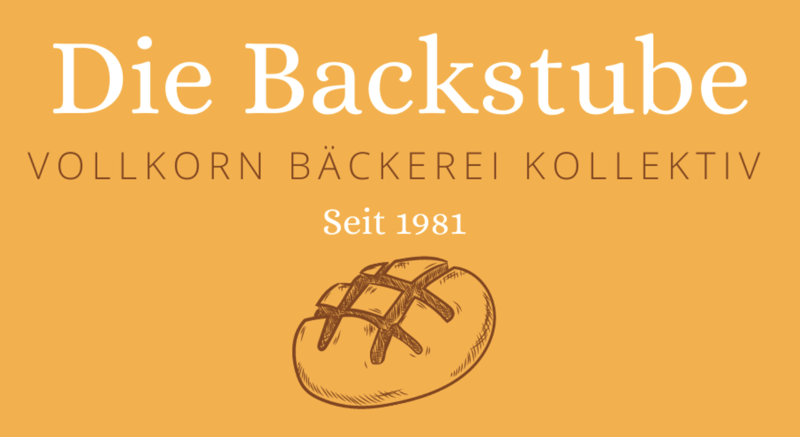
[Backstube Vollkornbäckerei GmbH](http://die-backstube.de)

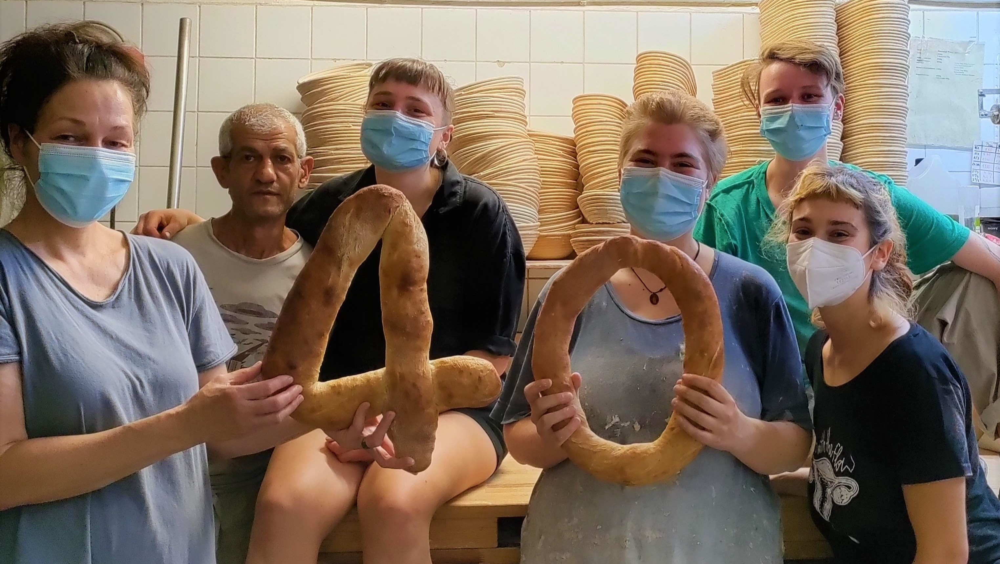
Members of Backstube collective

[Co-creation and the new landscapes of design](https://doi.org/10.1080/15710880701875068) by Elizabeth B.-N. Sanders and Pieter Jan Stappers, Co-design, 4(1):5–18, 2008.

> Designers have been moving increasingly closer to the future users of what they design and the next new thing in the changing landscape of design research has become co-designing with your users. But co-designing is actually not new at all, having taken distinctly different paths in the US and in Europe. The evolution in design research from a user-centred approach to co-designing is changing the roles of the designer, the researcher and the person formerly known as the ‘user’. The implications of this shift for the education of designers and researchers are enormous. The evolution in design research from a user-centred approach to co-designing is changing the landscape of design practice as well, creating new domains of collective creativity. It is hoped that this evolution will support a transformation toward more sustainable ways of living in the future.

[Ladder of citizen participation](https://www.citizenshandbook.org/arnsteinsladder.html)  
Sherry Arnstein, 1969

[Why the open source way trumps the crowdsourcing way, 2010](https://opensource.com/business/10/4/why-open-source-way-trumps-crowdsourcing-way)  
Libby Levi, 2010

[Co-design as interplay between actors and artifacts during carefully prepared activities](https://doi.org/10.1515/opis-2020-0102)  
Marian Dörk et al., 2020

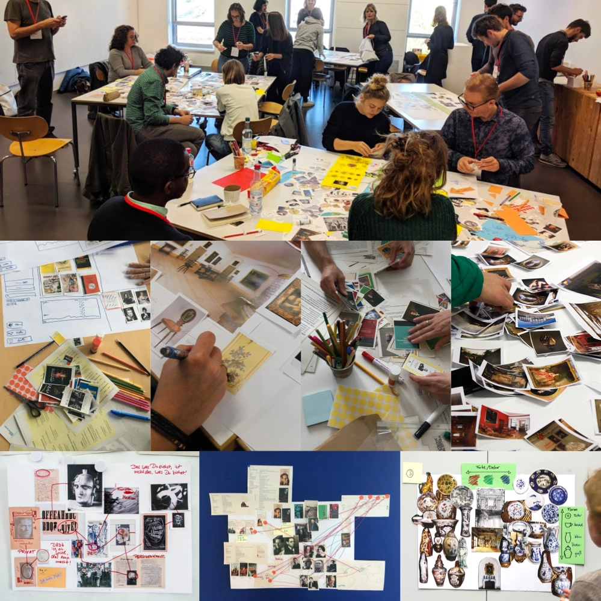
Co-design workshops carried out by researchers and students of FH Potsdam, 2015-2018

[The 5 levels of creativity](https://uxdesign.cc/ready-five-levels-of-creativity-2ef100ed12b5)  
Hoang Nguyen, 2020

[Flatbread Society Bakehouse](https://www.flatbreadsociety.net/actions/35/bakehouse/), 2012

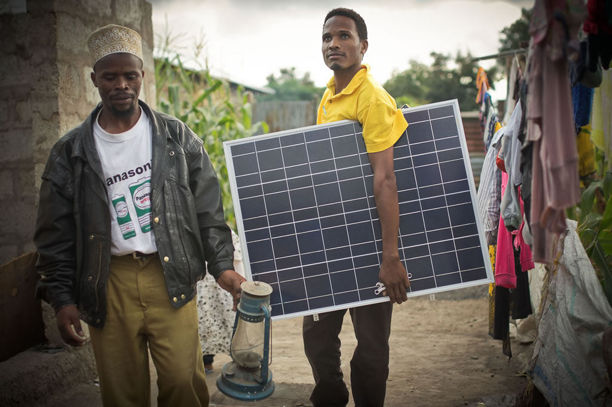
[Reinventing Solar Energy Supply for Rural Africa](https://thisisdesignthinking.net/2016/05/reinventing-solar-energy-supply-for-rural-africa/) by Caroline Szymanski, 2016

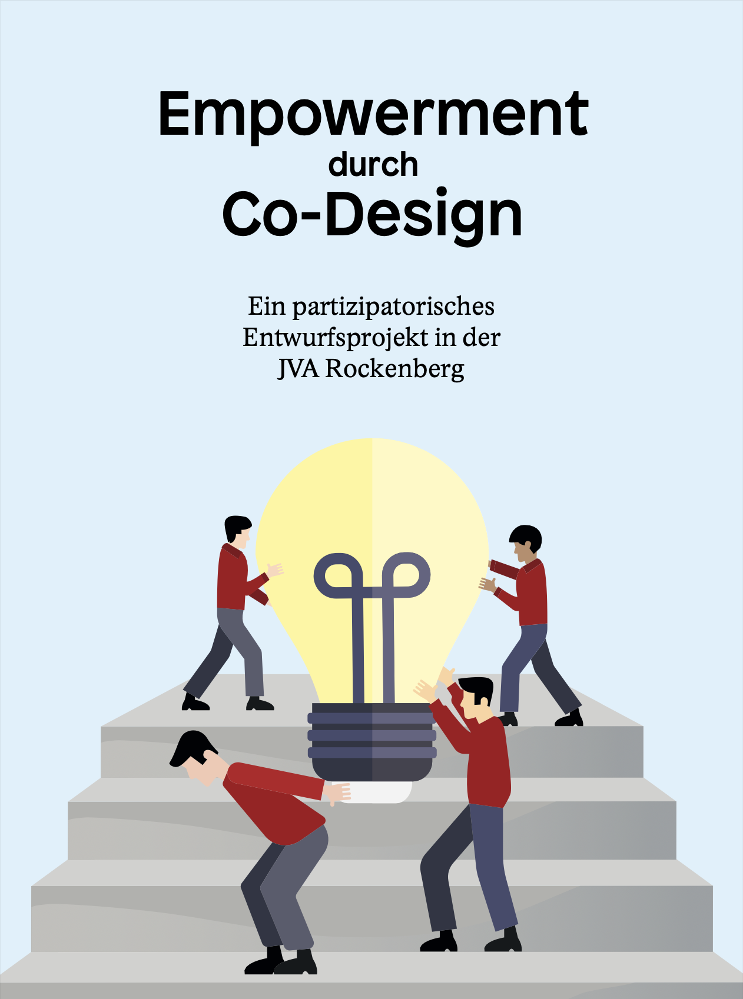
[Empowerment through co-design](http://www.applaus-potsdam.de/2018/aussteller/empowerment-durch-co-design)  
Bastian Braun, 2018

[Children, play, and the built environment.What can we learn from co-creation and embodied cognitive science?](https://www.cocplayfulminds.org/media/c5kplktm/coc-playful-minds_research-journal_build-environment.pdf) 
by CoC Playful Minds, 2020

---
5.6. gruppe F
## Work

[gruppe F - Freiraum für alle GmbH](https://gruppef.com/)

[Circles making waves](https://gruppef.com/en/circles-making-waves/)  
gruppe F, 2021

[Röyksopp - Remind Me](https://www.youtube.com/watch?v=cy_h4Lc5QSE), 2001

[The Problem with Work: Feminism, Marxism, Antiwork Politics, and Postwork Imaginaries](https://caringlabor.files.wordpress.com/2012/05/the-problem-with-work_-feminism-marxism-kathi-weeks.pdf) by Kathi Weeks. Duke University Press, 2011.

>In The Problem with Work, Kathi Weeks boldly challenges the presupposition that work, or waged labor, is inherently a social and political good. While progressive political movements, including the Marxist and feminist movements, have fought for equal pay, better work conditions, and the recognition of unpaid work as a valued form of labor, even they have tended to accept work as a naturalized or inevitable activity. Weeks argues that in taking work as a given, we have “depoliticized” it, or removed it from the realm of political critique. Employment is now largely privatized, and work-based activism in the United States has atrophied. We have accepted waged work as the primary mechanism for income distribution, as an ethical obligation, and as a means of defining ourselves and others as social and political subjects. Taking up Marxist and feminist critiques, Weeks proposes a postwork society that would allow people to be productive and creative rather than relentlessly bound to the employment relation. Work, she contends, is a legitimate, even crucial, subject for political theory.

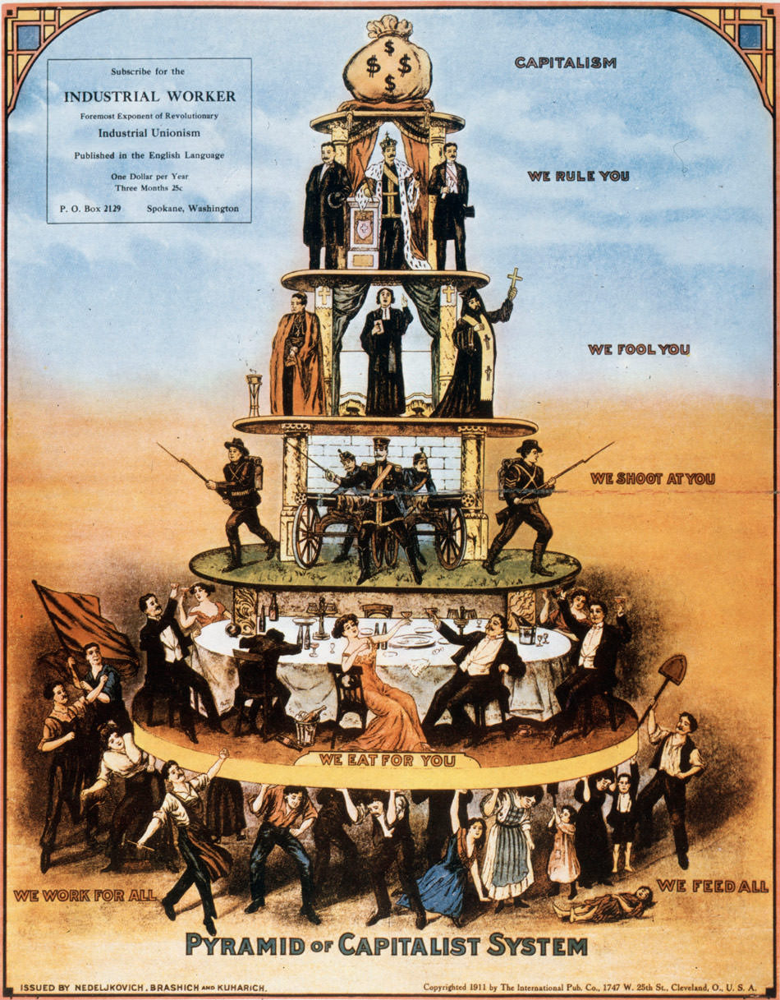
[Pyramid of Capitalist System](https://en.wikipedia.org/wiki/Pyramid_of_Capitalist_System)  
Nedeljkovich, Brashich & Kuharich, 1911

[*"childcare, cooking cleaning… unpaid work keeps women invisible, distracted and poor. So I drew zeros for #InternationalWomensDay"*](https://twitter.com/monachalabi/status/971795322904162304)  
Mona Chalabi, 2018

[Jobs still split along gender lines](https://ec.europa.eu/eurostat/web/products-eurostat-news/-/EDN-20180307-1)  
eurostat, 2018

[Women’s Unpaid Labor is Worth $10,900,000,000,000](https://www.nytimes.com/interactive/2020/03/04/opinion/women-unpaid-labor.html)  
Gus Wezerek & Kristen R. Ghodsee, The New York Times, 2020

  
[9 Ways to Imagine Jeff Bezos’ Wealth](https://www.nytimes.com/interactive/2022/04/07/magazine/jeff-bezos-net-worth.html)  
Mona Chalabi, The New York Times, 2022

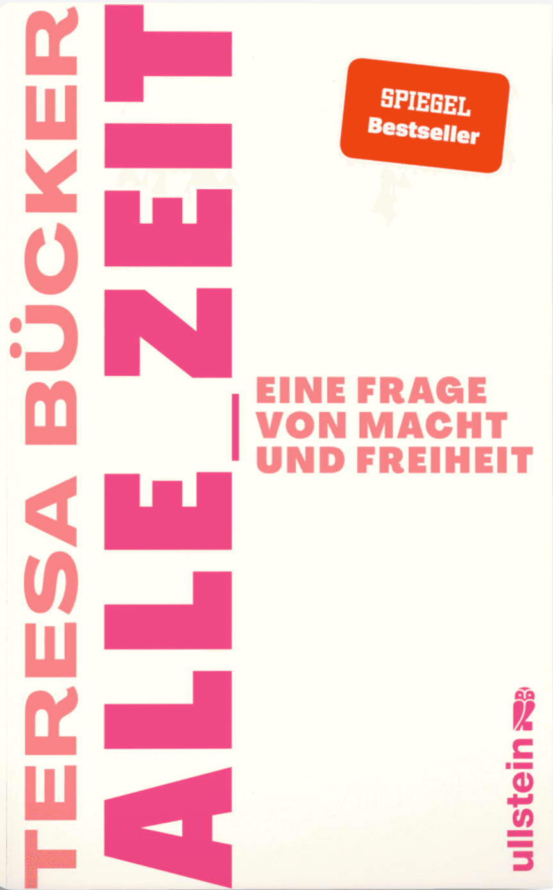
[Alle_Zeit. Eine Frage von Macht und Freiheit](https://www.ullstein.de/werke/alle-zeit/hardcover/9783550201721)  
Teresa Bücker, 2022

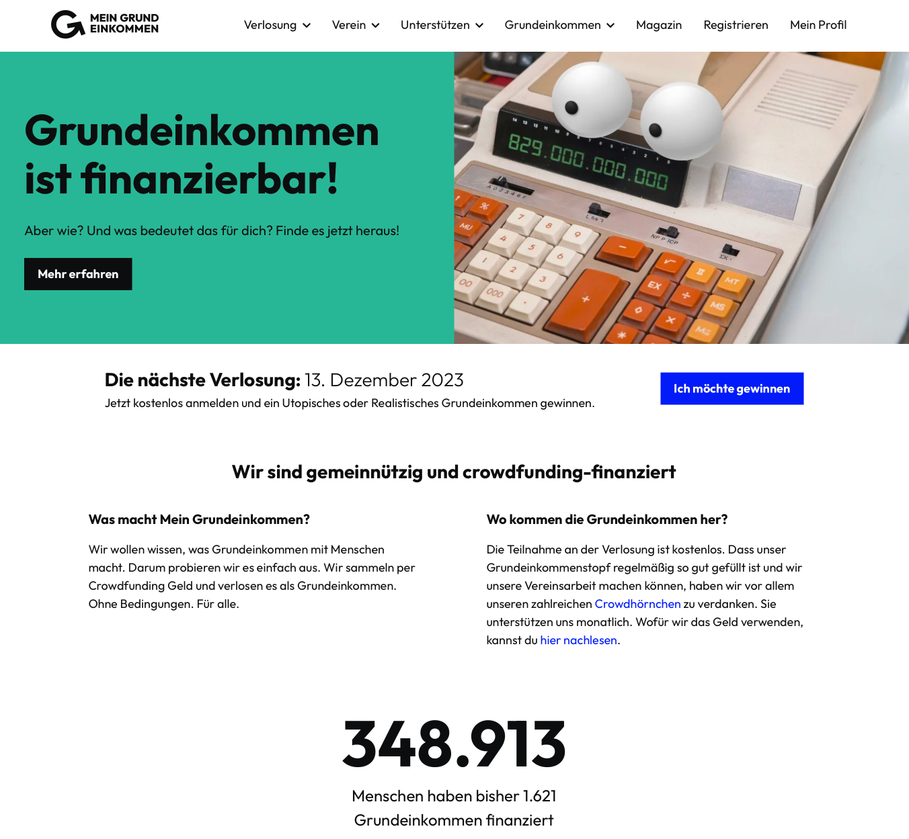
[Mein Grundeinkommen](https://www.mein-grundeinkommen.de), 2014

---
12.6. Regenbogenfabrik
## Commons

[Regenbogenfabrik e.V.](http://regenbogenfabrik.de/)  
children's, culture and neighborhood center

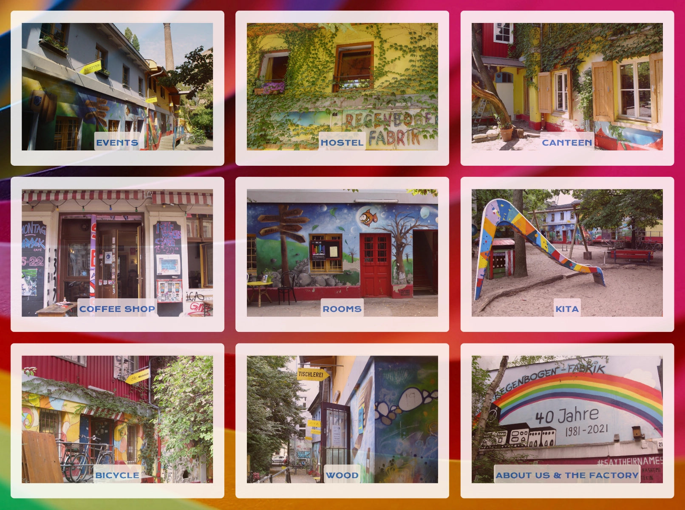
The main projects of [Rainbow Factory Berlin](http://regenbogenfabrik.de)

[Revisiting the commons: local lessons, global challenges](https://web.mit.edu/mission/www/m2018/pdfs/science.pdf) by Elinor Ostrom et al. Science, 284(5412):278–282, 1999.

> In a seminal paper, Garrett Hardin argued in 1968 that users of a commons are caught in an inevitable process that leads to the destruction of the resources on which they depend. This article discusses new insights about such problems and the conditions most likely to favor sustainable uses of common-pool resources. Some of the most difficult challenges concern the management of large-scale resources that depend on international cooperation, such as fresh water in international basins or large marine ecosystems. Institutional diversity may be as important as biological diversity for our long-term survival.

[A Framework for the Commons](https://www.onthecommons.org/work/framework-commons/index.html)  
On the Commons Team, 2012

[Legal Structures for Protecting the Commons](https://www.onthecommons.org/work/legal-structures-protecting-commons/index.html):
- Agricultural land trust
- Cooperative
- Co-housing 
- Land trust
- Public trust doctrine
- Trust

[Our open design commons](https://commonsblog.wordpress.com/2013/06/14/commoning-or-commoneering-wtf/)  
Silke Helfrich, 2012

[The Triad of Commoning](https://www.resilience.org/stories/2019-12-19/the-triad-of-commoning/)  
Silke Helfrich and David Bollier, 2019

[Free, Fair and Alive - The insurgent power of the commons](https://freefairandalive.org/read-it/) by David Bollier & Silke Helfrich, New Society Publishers, 2019

[Reclaiming the urban commons](https://www.re-thinkingthefuture.com/city-and-architecture/a2279-the-concept-of-commoning-what-architects-must-know/)  
urban code, 2019

[Creative Commons](https://creativecommons.org/about/)  

[Environmental Global Commons GSDR](https://www.youtube.com/watch?v=A9iRBVEU72c)  
UN DESA Sustainable Development, 2020

---
19.6. SuperCoop
## Cybersyn

[SuperCoop Berlin - This is not a SuperMarket…](https://supercoop.de/) 

[Character design and illustration for SuperCoop](https://cargocollective.com/marjoriemonnet/SUPER-FOOD-COOP-Berlin)  
Marjorie Monnet, 2019

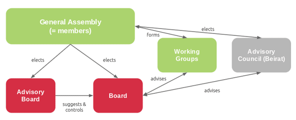
[Governance structure of SuperCoop Berlin](https://supercoop.de/en/our-cooperative/)  

Decision tree for missed shifts and shift replacements at SuperCoop Berlin

[Designing Freedom, Regulating a Nation: Socialist Cybernetics in Allende’s Chile](http://waste.informatik.hu-berlin.de/Lehre/ss11/SE_Kybernetik/reader/edenmedina_cinco.pdf) by Eden Medina. Journal of Latin American Studies, 38(3):571–606, 2006.

> This article presents a history of ‘Project Cybersyn’, an early computer network developed in Chile during the socialist presidency of Salvador Allende (1970–1973) to regulate the growing social property area and manage the transition of Chile’s economy from capitalism to socialism. Under the guidance of British cybernetician Stafford Beer, often lauded as the ‘father of management cybernetics’, an interdisciplinary Chilean team designed cybernetic models of factories within the nationalised sector and created a network for the rapid transmission of economic data between the government and the factory floor. The article describes the construction of this unorthodox system, examines how its structure reflected the socialist ideology of the Allende government, and documents the contributions of this technology to the Allende administration.

[3D rendering of Cybersyn opsroom](https://en.wikipedia.org/wiki/Project_Cybersyn)  
Rama, 2021

[MU/TH/UR 6000](https://alienanthology.fandom.com/wiki/MU-TH-UR_6000)  
Alien, 1979

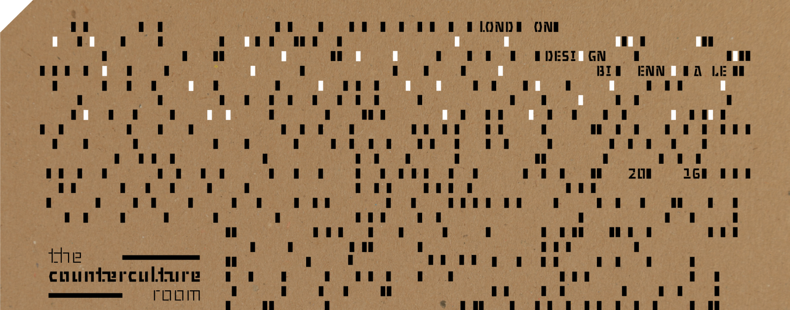
[the counterculture room](http://countercultureroom.com)  
London Design Biennale, 2016

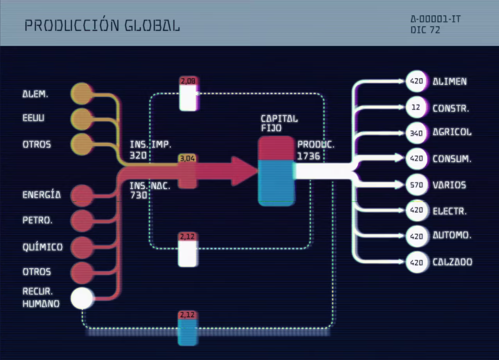
[Animated flowchart of economic production](https://vimeo.com/243861674)  
Manuela Garreton & Isidora González, 2016

[The Santiago Boys - Podcast](https://the-santiago-boys.com)  
Evgeny Morozov, 2023

---
26.6. WeiberWirtschaft
## Feminism

[WeiberWirtschaft eG - Standort für Chefinnen](https://weiberwirtschaft.de/)

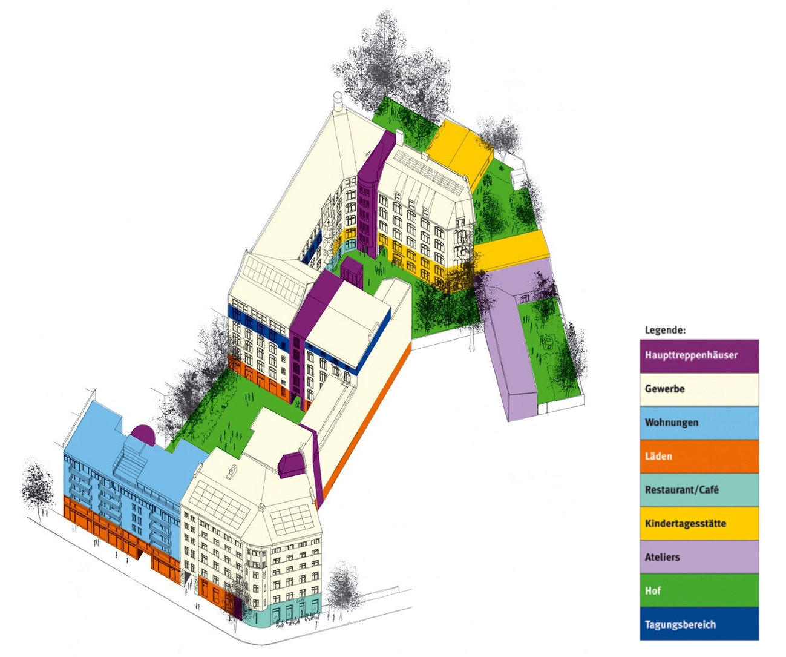
[Tour of WeiberWirtschaft](https://www.weiberwirtschaft.de/informieren/gruenderinnen-und-unternehmerinnenzentrum/rundgang/)  

 Data Feminism. [Introduction](https://doi.org/10.7551/mitpress/11805.003.0002) by Catherine D'Ignazio & Lauren F. Klein, MIT Press, 2020.

> Today, data science is a form of power. It has been used to expose injustice, improve health outcomes, and topple governments. But it has also been used to discriminate, police, and surveil. This potential for good, on the one hand, and harm, on the other, makes it essential to ask: Data science by whom? Data science for whom? Data science with whose interests in mind? The narratives around big data and data science are overwhelmingly white, male, and techno-heroic. In Data Feminism, Catherine D'Ignazio and Lauren Klein present a new way of thinking about data science and data ethics—one that is informed by intersectional feminist thought.

[Feminist Scrollytelling](https://infovis.fh-potsdam.de/femscroll/)  
Project course at FH Potsdam, 2019

[Data Feminism Infographics](http://datafeminism.io/blog/book/data-feminism-infographic/)  by Marcia Diaz, Catherine D'Ignazio & Lauren F. Klein, 2020

[Art of the March](https://vikusviewer.fh-potsdam.de/artofthemarch/) – digital archive of protest signs and posters collected after historic Boston Women's March on 21 January 2017

[Coded Bias | Trailer](https://www.youtube.com/watch?v=jZl55PsfZJQ), 2020

[Inter...what? Intersectionality! – A visual introduction](https://uclab.fh-potsdam.de/intervis/) by Hannah Schwan et al., 2021

[THE F*WORD - Guerrilla Girls and Feminist Graphic Design](https://www.mkg-hamburg.de/en/exhibitions/the-fword/), MK&G Hamburg, 2023

---
3.7. Madia
## Care

[Madia Potsdam - Gemeinschaft, Café und Familienwohnzimmer](https://madia-potsdam.de/)

[Matters of Care: Speculative Ethics in More Than Human Worlds](https://syllabus.pirate.care/library/Maria%20Puig%20de%20La%20Bellacasa/Matters%20of%20Care%20(171)/Matters%20of%20Care%20-%20Maria%20Puig%20de%20La%20Bellacasa.pdf) by María Puig de la Bellacasa, Introduction (pages 1-24). Posthumanities. University of Minnesota Press, 2017.

> To care can feel good, or it can feel bad. It can do good, it can oppress. But what is care? A moral obligation? A burden? A joy? Is it only human? In Matters of Care, María Puig de la Bellacasa presents a powerful challenge to conventional notions of care, exploring its significance as an ethical and political obligation for thinking in the more than human worlds of technoscience and naturecultures.

[Mierle Laderman Ukeles, Washing/ Tracks/ Maintenance: Outside (July 23, 1973)](https://www.youtube.com/watch?v=WIhf3UBNTlA)  
Smarthistory, 2018

[Care Revolution, 2018](https://care-revolution.org)

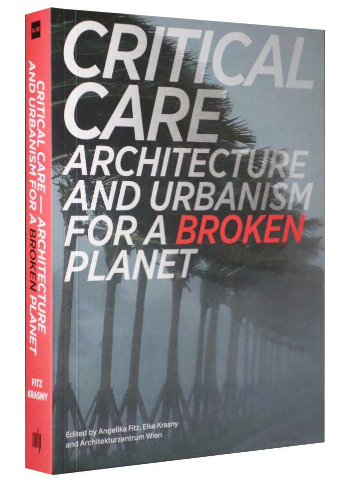

[Critical Care: Architecture and Urbanism for a Broken Planet](https://doi.org/10.7551/mitpress/12273.001.0001) edited by Angelika Fitz, Elke Krasny, Architekturzentrum Wien, 2019

[Was ist eine Caring Community?](https://www.youtube.com/watch?v=DMPPmGYVuyg)  
Netzwerk Caring Communities Schweiz, 2022

---
# Projects

Aiming to visualize structures of a social-ecological economy, each student carried out a small data visualization project, spanning data collection, visualization design, and iterative prototyping. 

The following visualization projects are based on the practices and principles encountered during the visits, readings, and exchanges throughout the semester. 

### Central questions

- What would you like to reveal with the organigrams you will make?
- What kind of work relations would you like to put out there for discussion?

---
<!--skipnav-->
## [CO-OP.COMM](https://fhp.incom.org/project/25346)

> Within the course, we visited different collectives, cooperatives and other company models that were on a path towards cooperativism. These structures communicate with each other in interwoven, self-determined and fluid ways. Through this unique communication, they jointly develop sustainable and subjective solutions. Communication can help transport values, ideas and benefits of collectives and cooperatives. But because of the individuality of each co-structure, explaining them is often not easy. It takes curiosity and exploration to gain an understanding. I understand this work as an attempt to visualise the complex communication structure of cooperatives and verify the hypothesis if this can function as a mirror of the complex co-operative work environment.

Vivien Serve

---
<!--skipnav-->
## [Status Growth](https://fhp.incom.org/project/25152)

> In an environment mainly consisting of hierarchically organised companies some alternative ways of organising work emerge: cooperatives. What defines their way of growing? What is their influence on traditionally organised companies? How do they affect not only working environment but also our way of thinking?

Jaqueline Grob

---
<!--skipnav-->
## [Flexibility equals power](https://www.figma.com/file/sqE0zBAuWFxidxotFlhuSh/flexibility-equals-power-final?type=design&node-id=0-1&mode=design)

> This prototype of an animated organigram illustrates the transformation from a hierarchical structured company to a cooperative one, highlighting the significance of flexibility and its effects on both individuals and the collective.

Luka Saje

---
<!--skipnav-->
## [Flows of Non-Pecuniary Values](https://fhp.incom.org/project/25222)

> The aim of this project is to show how our capitalist world can move towards degrowth by focusing on values other than money.
One of the major problems in our society is monetary value. It is an infinite value that we place in a finite world with limited resources.
So what would happen if we did away with money?
This organigram explores the different streams of non-pecuniary value in a heterotopia.

Chloé Le Mézo

---
<!--skipnav-->
## [Money Flow](https://vimeo.com/843699475)

> This project explores the often sensitive and under-discussed topic of financial distribution within cooperatives. Despite a common belief that "money has no value" in such settings and that resources are equally shared, this research aims to uncover the actual dynamics at play. It delves into the origins of the funds in cooperatives, the methods of allocation among members, and the final monetary compensation each member receives.

Julia Semenikhina

---
<!--skipnav-->
## [Values of cooperatives](https://prezi.com/view/VSVmkvg7c5UTmqBrTZkw/)

> Each everyday object the coop members use, subconsciously embody a value of the organization, this gets spread between the members as they use and share that object, helping them build the social environment the coop is shaped on.

Beatrice Leone

---
<!--skipnav-->
## [Interdependency and Collaboration in a Co-operative](https://www.youtube.com/watch?v=LrMH18PGSMU)

> The goal of this data visualization project is to demonstrate the relationships, interactions and overlaps within a cooperative, taking inspiration from the intricate yet incredibly powerful interactions of human cells. The project highlights the significance of working together towards a common goal, like how human cells collaborate to ensure the body functions properly. Exploring this concept delves into the collective entity that cooperatives embody.

Dishunee Pandya

---
<!--skipnav-->
## Social Innovation

> The aim of my project was to try to analyse and narrate the historical and cultural value that collectives and cooperatives carry today, in 2023. I interpreted these organisations as bearers of *Social Innovation*, a concept now recognised by the European Union that indicates the construction of "new ideas: services, products or models that meet people needs, create relationships and form new collaborations". Social Innovation can be seen as a response to the enormous density of changes that have occurred since the last century, which have shaken the balance of the world in a very short space of time. In my research, I wanted to see these organisations as part of the path our society is taking in search of a new balance, and new ways of being together.

Viviana Sorvillo

---
<!--skipnav-->
## Soupi

> Soupi is a student foodsaving project that cooks delicious, healthy soups with saved foods.
It will also be a design course, an educational program at schools and a movement that connects people and helps to reduce foodwaste.
At this point we connected with foodsources like supermarkets, people who work in foodsaving projects since years and cooked our first soups from saved vegetables.
The organigram is visualizing the process of turning the saved foods into soups from the foodsources and the non-hierarchical, democratic structure of the course that allows everyone at Soupi to bring in their own ideas and visions.

Georg Wähmer

---
 
 

[Contact](mailto:marian.doerk@fh-potsdam.de,myriel.milicevic@fh-potsdam.de?subject=Organigrams%20for/from%20the%20future) · [Imprint](https://www.fh-potsdam.de/impressum) · *This is a [Syllabus Site](https://github.com/uclab-potsdam/syllabus-site/)*