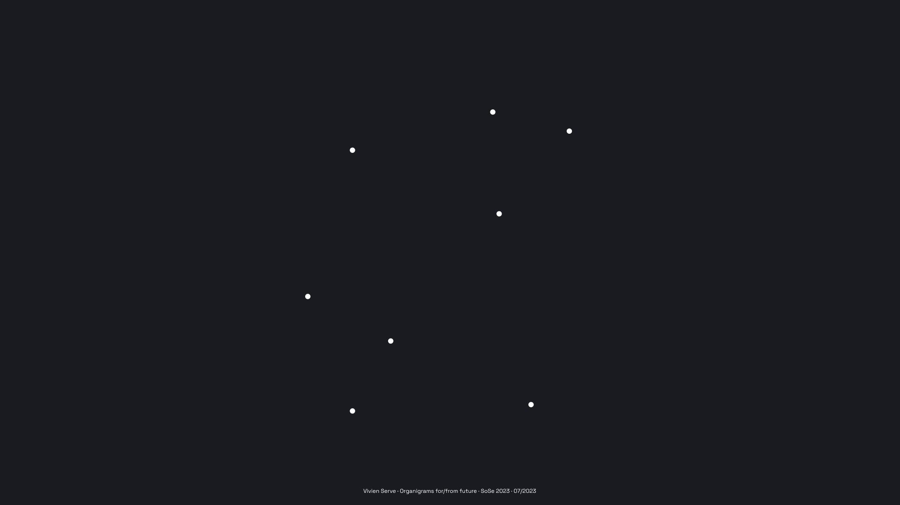

Summer 2023 · [Interface Design](https://interface.fh-potsdam.de) · [FH Potsdam](https://www.fh-potsdam.de/)

# Organigrams for/from the future

The aim of this course is to visualize an economy built on solidarity, sustainability, and survival—instead of exploitation, extraction, and extinction. Given multiple interconnected crises, there is an urgent need to devise new kinds of structures that let us weave resilient relations with each other and the world we live in. Data visualization is typically used to represent what is, but rarely how things could and maybe should be. 

We will take on the challenge to visualize organizational structures that hardly exist yet, but are foreshadowed in the experimental configurations of cooperatives, projects, and initiatives. To find inspiration we will visit a range of organizations that are committed to social-ecological transformation and operate on principles of social and ecological justice. These organizations will share their experiences and offer opportunities to see innovative ways of working together, making decisions, and cultivating cooperation in critical times.

This webpage presents a selective documentation of key readings, inspiring projects, our generous hosts, and the resulting projects.

  
Prof. Dr. Marian Dörk

  
Prof. Myriel Milicevic

  
New York and Erie Railroad, 1855

Aiming to visualize structures of a social-ecological economy, each student will carry out a small data visualization project, spanning data collection, visualization design, and iterative prototyping. The visualizations will be based on practices and principles encountered during the visits, readings, and exchanges throughout the semester. While students will work individually on their projects, the entire course will form a temporary collective experimenting with some of the principles we encounter during the semester.

**Central questions for the course**

- What would you like to reveal with the organigrams you will make?
- What kind of work relations would you like to create for the future and put out there for discussion?

3 April
## Kick-off

This is an experimental course on the visualization of organizational structures utilizing narration and exploration to encourage reflection and imagination about work and the economy.

> It's easier to imagine the end of the world than the end of capitalism.

Jameson, F. (1996). The Seeds of Time.

 K.C. Green, 2016

> It is hard to say what today's dreams are; it seems they have been downgraded to hopes—hope that we will not allow ourselves to become extinct, hope that we can feed the starving, hope that there will be room for us all on this tiny planet. There are no more visions. We don't know how to fix the planet and ensure our survival. We are just hopeful.

 Dunne, A. and Raby, F. (2013). Speculative everything: design, fiction, and social dreaming.

  
Andrew Yang, 2012 - present

> That is the fundamental nature of gifts: they move, and their value increases with their passage. The fields made a gift of berries to us and we made a gift of them to our father. The more something is shared, the greater its value becomes. This is hard to grasp for societies steeped in notions of private property, where others are, by definition, excluded from sharing. Practices such as posting land against trespass, for example, are expected and accepted in a property economy but are unacceptable in an economy where land is seen as a gift to all.

> From the viewpoint of a private property economy, the “gift” is deemed to be “free” because we obtain it free of charge, at no cost. But in the gift economy, gifts are not free. The essence of the gift is that it creates a set of relationships. The currency of a gift economy is, at its root, reciprocity. In Western thinking, private land is understood to be a “bundle of rights,” whereas in a gift economy property has a “bundle of responsibilities” attached.

Kimmerer, R. W. (2013). Braiding Sweetgrass: Indigenous Wisdom, Scientific Knowledge and the Teachings of Plants.

### Guiding research questions

- How can we translate observations about innovative organizational structures and work processes into coherent data visualizations?
- What are approaches that let us integrate social, aesthetic, and technical aspects into intriguing and informative representations?
- Is it possible to account for complex issues in a comprehensible data visualization that does justice to the social and ecological challenges?

### Themes

The course passes through ten central themes, each of which is accompanied by a key reading and a range of visual materials such as exemplary diagrams and visualizations:
- Utopia
- Co-ops
- Platforms
- Economies
- Co-design
- Work
- Commons
- Cybersyn
- Feminism
- Care

### Hosts

Every week the course takes place at different locations in Berlin or Potsdam. Below are the organizations and initiatives that have agreed to tell us all about their organizational structures and generously offered to host us for one seminar session each:

-   [WIGWAM eG - Kommunikationsagentur](https://wigwam.im)
-   [INFOTEXT - Agentur für Content & Grafikdesign](https://infotext-berlin.de/)
-   [SMartDe eG - Genossenschaft für Selbständige](https://smart-eg.de)
-   [Regionalwert AG Berlin Brandenburg](https://regionalwert-berlin.de)
-   [Backstube Vollkornbäckerei](http://die-backstube.de)
-   [gruppe F Berlin - Freiraum für alle GmbH](https://gruppef.com/)
-   [Regenbogenfabrik e.V. - Kinder-, Kultur- und Nachbarschaftszentrum](http://regenbogenfabrik.de)
-   [SuperCoop Berlin - This is not a SuperMarket…](https://supercoop.de)
-   [WeiberWirtschaft eG - Standort für Chefinnen](https://weiberwirtschaft.de/)
-   [Madia Potsdam - Gemeinschaft, Café und Familienwohnzimmer](https://madia-potsdam.de)

17 April
## Utopia

Lueder, C. (2013). [Diagram Utopias: Rota and Network as Instrument and Mirror of Utopia and Agronica](https://infovis.fh-potsdam.de/readings/lueder2013diagram.pdf). Journal of Architectural Education, 67(2):224–233.

> Utopian visions and diagrams have engaged in a multitude of relationships. For example, a utopian narrative can be conceived as a diagram, or with the aid of diagrams, and understood through diagrammatic (re) annotation. This notion is explored through an interpretation of Thom- as More’s Utopia and Andrea Branzi’s Agronica. Both schemes address various structural conditions through diagrammatic operations. In More’s scheme the channel that separates Utopia from the mainland, dug by its putative founder King Abraxas, inscribes a circular boundary, reiterated in the city walls and moat; it is resonant with contempora- neous rota and volvelle schemata. Conversely, Andrea Branzi’s “mirror simulator” multiplies Agronica’s centrifugal grid to infinity, negating the “outside,” and is evocative of pervasive virtual networks.

  
Wigwam eG

  
Hieronymus Bosch, 1490-1510

)  
Ambrosius Holbein, 1516

  
Petrus Apianus, 1540

  
Ebenezer Howard, 1902

  
Frank Lloyd Wright, 1932

  
Andrea Branzi, 1995

  
Mercedes-Benz Group, 2019

  
Lino Zeddies, 2023

24 April
## Co-ops

Fairbairn, B. et al. (1994). [The meaning of Rochdale: The Rochdale Pioneers and the co-operative principles](https://ageconsearch.umn.edu/record/31778/files/re94fa01.pdf). Technical report, University of Saskatchewan, Centre for the Study of Co-operatives.

> Rochdale, England, is known by millions for one reason: a handful of labourers established a co-operative there in 1844 known as the Rochdale Society of Equitable Pioneers. That co-operative was adopted as the inspiration and model for a movement that now includes nearly 700 million people around the world. As this paper is being written, co-operators around the world are preparing to celebrate the 150th anniversary of its birth. But what did Rochdale mean? Why is it considered so important?"}

  
INFOTEXT Berlin

  
Co-operative flag, 1925

  
Liberating Structures, 2012

  
Mondragon Cooperative Corporation, 2015

  
Willy Street Co-op, 2016

  
Bullfrog Films presents...FOOD COOP, 2017

  
Upstream Podcast / Phil Wrigglesworth, 2018

  
Co op City, The Bronx DiverseCITY, 2019

  
Exploring Co-op City - The Bronx, NYC, 2021

  
At Home in Utopia Trailer, 2021

  
Robert M. Fogelson, 2022

The following [cooperative principles](https://www.ica.coop/en/cooperatives/cooperative-identity) help coops turn their values into practice:

1. Voluntary and Open Membership
2. Democratic Member Control
3. Member Economic Participation
4. Autonomy and Independence
5. Education, Training, and Information
6. Cooperation among Cooperatives
7. Concern for Community

8 May
## Platforms

Scholz, T. (2016). [Platform cooperativism. Challenging the corporate sharing economy](https://rosalux.nyc/wp-content/uploads/2020/11/RLS-NYC_platformcoop.pdf). New York, NY: Rosa Luxemburg Foundation.

> Among all the problems with 21st-century work — the ballooning of the low wage service sector, economic inequality, the crumbling of worker rights  — the main problem really is that there are so few realistic alternatives. What has been missing from the debate about the future of work is an approach that offers peo- ple something that they can wholeheartedly embrace. This is what this essay is about.

  
SMartDe eG

  
Paul Baran, 1962

Skowronnek, A., Vogel, L. & Parnow, J. (2015) [AIRBNB vs. BERLIN. Was sagen die Daten?](https://airbnbvsberlin.de)

  
Alsino Skowronnek, Lucas Vogel & Jonas Parnow, 2015

  
Trebor Scholz, 2018

  
Platform Cooperativism, 2020

  
Per Axbom, 2022

  
Victoria Sgarro, 2023

15 May
## Economies

Raworth, K. (2012). [A safe and just space for humanity](https://www-cdn.oxfam.org/s3fs-public/file_attachments/dp-a-safe-and-just-space-for-humanity-130212-en_5.pdf). Oxfam Discussion Paper.

> Humanity’s challenge in the 21st century is to eradicate poverty and achieve prosperity for all within the means of the planet’s limited natural resources. In the run-up to Rio+20, this discussion paper presents a visual framework – shaped like a doughnut – which brings planetary boundaries together with social boundaries, creating a safe and just space between the two, in which humanity can thrive. Moving into this space demands far greater equity – within and between countries – in the use of natural resources, and far greater efficiency in transforming those resources to meet human needs.

  
Regionalwert AG Berlin Brandenburg

22 May
## Co-design

Sanders, E. B.-N. and Stappers, P. J. (2008). [Co-creation and the new landscapes of design](https://doi.org/10.1080/15710880701875068). Co-design, 4(1):5–18.

> Designers have been moving increasingly closer to the future users of what they design and the next new thing in the changing landscape of design research has become co-designing with your users. But co-designing is actually not new at all, having taken distinctly different paths in the US and in Europe. The evolution in design research from a user-centred approach to co-designing is changing the roles of the designer, the researcher and the person formerly known as the ‘user’. The implications of this shift for the education of designers and researchers are enormous. The evolution in design research from a user-centred approach to co-designing is changing the landscape of design practice as well, creating new domains of collective creativity. It is hoped that this evolution will support a transformation toward more sustainable ways of living in the future.

  
Backstube Vollkornbäckerei

5 June
## Work

Weeks, K. (2011). [The Problem with Work: Feminism, Marxism, Antiwork Politics, and Postwork Imaginaries](https://caringlabor.files.wordpress.com/2012/05/the-problem-with-work_-feminism-marxism-kathi-weeks.pdf). Introduction chapter. Pages 1–36. Duke University Press.

>In The Problem with Work, Kathi Weeks boldly challenges the presupposition that work, or waged labor, is inherently a social and political good. While progressive political movements, including the Marxist and feminist movements, have fought for equal pay, better work conditions, and the recognition of unpaid work as a valued form of labor, even they have tended to accept work as a naturalized or inevitable activity. Weeks argues that in taking work as a given, we have “depoliticized” it, or removed it from the realm of political critique. Employment is now largely privatized, and work-based activism in the United States has atrophied. We have accepted waged work as the primary mechanism for income distribution, as an ethical obligation, and as a means of defining ourselves and others as social and political subjects. Taking up Marxist and feminist critiques, Weeks proposes a postwork society that would allow people to be productive and creative rather than relentlessly bound to the employment relation. Work, she contends, is a legitimate, even crucial, subject for political theory.

  
gruppe F Berlin

12 June
## Commons

Ostrom, E., Burger, J., Field, C. B., Norgaard, R. B., and Policansky, D. (1999). [Revisiting the commons: local lessons, global challenges](http://infovis.fh-potsdam.de/readings/ostrom1999revisiting.pdf). science, 284(5412):278–282.

> In a seminal paper, Garrett Hardin argued in 1968 that users of a commons are caught in an inevitable process that leads to the destruction of the resources on which they depend. This article discusses new insights about such problems and the conditions most likely to favor sustainable uses of common-pool resources. Some of the most difficult challenges concern the management of large-scale resources that depend on international cooperation, such as fresh water in international basins or large marine ecosystems. Institutional diversity may be as important as biological diversity for our long-term survival.

  
Regenbogenfabrik e.V.

19 June
## Cybersyn

Medina, E. (2006). [Designing Freedom, Regulating a Nation: Socialist Cybernetics in Allende’s Chile](http://infovis.fh-potsdam.de/readings/medina2006designing.pdf). Journal of Latin American Studies, 38(3):571–606.

> This article presents a history of ‘Project Cybersyn’, an early computer network developed in Chile during the socialist presidency of Salvador Allende (1970–1973) to regulate the growing social property area and manage the transition of Chile’s economy from capitalism to socialism. Under the guidance of British cybernetician Stafford Beer, often lauded as the ‘father of management cybernetics’, an interdisciplinary Chilean team designed cybernetic models of factories within the nationalised sector and created a network for the rapid transmission of econ- omic data between the government and the factory floor. The article describes the construction of this unorthodox system, examines how its structure reflected the socialist ideology of the Allende government, and documents the contributions of this technology to the Allende administration.

  
SuperCoop Berlin

26 June
## Feminism

D’Ignazio, C. and Klein, L. F. (2020). Data Feminism. MIT Press. [Introduction chapter](https://doi.org/10.7551/mitpress/11805.003.0002).

> Today, data science is a form of power. It has been used to expose injustice, improve health outcomes, and topple governments. But it has also been used to discriminate, police, and surveil. This potential for good, on the one hand, and harm, on the other, makes it essential to ask: Data science by whom? Data science for whom? Data science with whose interests in mind? The narratives around big data and data science are overwhelmingly white, male, and techno-heroic. In Data Feminism, Catherine D'Ignazio and Lauren Klein present a new way of thinking about data science and data ethics—one that is informed by intersectional feminist thought.

  
WeiberWirtschaft eG

3 July
## Care

de la Bellacasa, M. P. (2017). [Matters of Care: Speculative Ethics in More Than Human Worlds](https://syllabus.pirate.care/library/Maria%20Puig%20de%20La%20Bellacasa/Matters%20of%20Care%20(171)/Matters%20of%20Care%20-%20Maria%20Puig%20de%20La%20Bellacasa.pdf). Introduction (pages 1-24). Posthumanities. University of Minnesota Press.

> To care can feel good, or it can feel bad. It can do good, it can oppress. But what is care? A moral obligation? A burden? A joy? Is it only human? In Matters of Care, María Puig de la Bellacasa presents a powerful challenge to conventional notions of care, exploring its significance as an ethical and political obligation for thinking in the more than human worlds of technoscience and naturecultures.

  
Madia Potsdam

# Projects

Create one *organigram for/from the future,* i.e., a visualization of a cooperative work principle, structure and/or process that can help foster a social-ecological economy.

<!--skipnav-->
## [CO-OP.COMM](https://fhp.incom.org/project/25346)  
### Visualizing the communication landscape in collaborative work environments

> Within the course, we visited different collectives, cooperatives and other company models that were on a path towards cooperativism. These structures communicate with each other in interwoven, self-determined and fluid ways. Through this unique communication, they jointly develop sustainable and subjective solutions. Communication can help transport values, ideas and benefits of collectives and cooperatives. But because of the individuality of each co-structure, explaining them is often not easy. It takes curiosity and exploration to gain an understanding. I understand this work as an attempt to visualise the complex communication structure of cooperatives and verify the hypothesis if this can function as a mirror of the complex co-operative work environment.

  \
Vivien Serve

The current version of co-op.comm is presented as a [Figma prototype](https://www.figma.com/proto/d8CQHPhjl30T0BQ1ud5Z40/Unfolding-the-edges-of-communication?kind=proto&node-id=588-445426&page-id=579%3A439053&scaling=min-zoom&starting-point-node-id=588%3A445426&t=Kwvimi6MrSj9fhXM-1&type=design&viewport=606%2C116%2C0.15) and contains 3 visualized cooperative models.

 
 

[Imprint](https://www.fh-potsdam.de/impressum) · [Privacy](https://www.fh-potsdam.de/en/privacy) · *Created with [Syllabus Site](https://github.com/uclab-potsdam/syllabus-site/)*